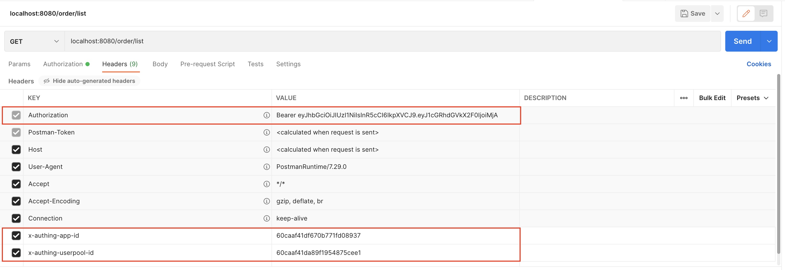

# authing-sample-backend

Suppose you are building an on-line shopping application. Right after your user identifies himself in your front end UI,
He starts to request some protected resource from your backend, for example, his order history. How do you authenticate your user?

There are many IdP (identity provider) out there, in this example, we try to integrate with an IdP called [Authing](https://www.authing.cn/).

We will build an *actual spring boot Java backend* that creates, lists, and deletes user's order. These APIs are protected which means before accessing these APIs, we must verify user's identity.
The identity is in the form of JWT token, it is submitted by our front end, e.g. an mobile App.
The JWT token is included in HTTP request header, i.e.

```
Authorization: Bearer {JWT token representing user's identity}
```

You can use Authing's [Java SDK](https://docs.authing.cn/v2/en/reference/sdk-for-java/). However, to make things more fun, let's do some hacking and build our backend by hand.

## Create project

use your favorite IDE to create a Java-gradle project

## Add dependency

Here we only add general Spring Boot dependencies, JSON handler, MyBatis, MySQL connector

```groovy
implementation 'org.springframework.boot:spring-boot-starter-web:2.5.1'
implementation 'org.mybatis.spring.boot:mybatis-spring-boot-starter:2.2.2'
implementation 'com.alibaba:fastjson:1.2.73'
implementation 'mysql:mysql-connector-java:8.0.25'
```

## Add database configuration

install and start MySQL locally, create a schema called `shopping` and 
create `application.yml` file under `resource` fold, then set up the database connection:

```yaml
spring:
  datasource:
    url: jdbc:mysql://localhost:3306/shopping?serverTimezone=UTC&useUnicode=true&characterEncoding=utf-8&useSSL=true
    username: root
    password: { your db password }
    driver-class-name: com.mysql.cj.jdbc.Driver
```

## Create controller

A typical Spring Boot app uses MVC design pattern, the http endpoints are exposed to your client via *controllers*, here is an example:

```java
@RestController
@RequestMapping("order")
public class OrderController {
    @GetMapping("/list")
    public String list(HttpServletRequest request, HttpServletResponse response) {
        return "hello world";
    }
}
```

The above code creates an endpoint. Start your server and enter `http:localhost:8080/order/list` in browser, you will get 'hello world' as response.

## User identity in JWT

We will use this tool to get a sample JWT: [Auth Toolkit](https://developer-beta.authing.cn/ams/auth-tool/index.html)

Simply hit 'Login' button, and sample JWT will be returned in the text area.

## Verify the JWT in our backend

Spring uses AOP (Aspect oriented programming), so we will add a *filter* in our project so that all endpoints are *filtered* before doing any real business logic.

* create a filter config class:

```java
import org.springframework.boot.web.servlet.FilterRegistrationBean;
import org.springframework.context.annotation.Bean;
import org.springframework.context.annotation.Configuration;

@Configuration
public class FilterConfig {
    @Bean
    public FilterRegistrationBean<AuthFilter> registerFilter() {
        FilterRegistrationBean<AuthFilter> registration = new FilterRegistrationBean<>();
        registration.setFilter(new AuthFilter());
        registration.addUrlPatterns("/*");
        registration.setName("AuthFilter");
        registration.setOrder(1);
        return registration;
    }
}
```

* create AuthFilter class:

```java
import com.alibaba.fastjson.JSON;
import com.alibaba.fastjson.TypeReference;
import com.lance.BaseResponse;
import com.lance.UserInfo;

import javax.servlet.*;
import javax.servlet.http.HttpServletRequest;
import javax.servlet.http.HttpServletResponse;
import java.io.IOException;
import java.net.URI;
import java.net.http.HttpClient;
import java.net.http.HttpRequest;
import java.net.http.HttpResponse;

public class AuthFilter implements Filter {

    @Override
    public void doFilter(ServletRequest request, ServletResponse response, FilterChain chain) throws IOException, ServletException {
        HttpServletRequest servletRequest = (HttpServletRequest)request;

        String uri = servletRequest.getRequestURI();
        String authorization = servletRequest.getHeader("authorization");
        HttpServletResponse servletResponse = (HttpServletResponse)response;
        if (authorization == null || !authorization.startsWith("Bearer ")) {
            servletResponse.setStatus(401);
            servletResponse.getWriter().print("Unauthorized. Please login first");
            return;
        }

        String appId = servletRequest.getHeader("x-authing-app-id");
        String userPoolId = servletRequest.getHeader("x-authing-userpool-id");
        if (appId == null || userPoolId == null) {
            servletResponse.setStatus(403);
            servletResponse.getWriter().print("client app invalid. please send x-authing-app-id and x-authing-userpool-id");
            return;
        }

        authorization = authorization.replace("Bearer ", "");
        String url = "https://core.authing.cn/api/v2/users/me";
        HttpClient client = HttpClient.newHttpClient();
        HttpRequest req = HttpRequest.newBuilder()
                .uri(URI.create(url))
                .GET()
                .header("Authorization", authorization)
                .header("x-authing-app-id", appId)
                .header("x-authing-userpool-id", userPoolId)
                .build();
        try {
            HttpResponse<String> res = client.send(req, HttpResponse.BodyHandlers.ofString());
            BaseResponse<UserInfo> resp = JSON.parseObject(res.body(), new TypeReference<BaseResponse<UserInfo>>(){});
            if (resp == null || resp.getCode() != 200) {
                servletResponse.setStatus(401);
                servletResponse.getWriter().print("bearer authorization invalid");
            } else {
                request.setAttribute("UserInfo", resp.getData());
                chain.doFilter(request, response);
            }
        } catch (Exception e) {
            servletResponse.setStatus(500);
            servletResponse.getWriter().print("Internal error");
            e.printStackTrace();
        }
    }

    @Override
    public void destroy() {
        Filter.super.destroy();
    }
}
```

let's examine the filter closely. 

We firstly try to get a *Bearer authorization* from header, if not presented, we know user is not logged in.

Next, we get `appId` and `userPoolId` from header. You can get these two values at Authing console.

Because a same person can be in multiple organizations (user pool), inside the same pool there can be multiple applications, and access control are configured at application level, so we must know which user pool and app to authenticate against.

Finally, we call an API from Authing to verify JWT, `/api/v2/users/me` to verify the JWT token.

## Access user info in your business logic

If you run the server again, and enter `http:localhost:8080/order/list` in browser, instead of return "hello world", the server will now return "Unauthorized. Please login first".
This is because all endpoints are filtered, without valid JWT token, the program will not reach your controller at all. It returns an error inside the filter. As a result, your APIs which will return user-related data, are *protected*.

Now it's time to switch from browser to Postman or any other HttpClient tool.

Add 'authorization' in the request header, and the value is what you get from [Auth Toolkit](https://developer-beta.authing.cn/ams/auth-tool/index.html)

Also add `x-authing-app-id` and `x-authing-userpool-id` in the request header.

Since we are using [Auth Toolkit](https://developer-beta.authing.cn/ams/auth-tool/index.html), so you can copy the value from there:

```java
x-authing-app-id = "60caaf41df670b771fd08937";
x-authing-userpool-id = "60caaf41da89f1954875cee1";
```

The request should be something like the following:



Send the request, you will get "hello world" again.

This means your endpoint is now protected by authentication, user *must* firstly authenticate himself and get a valid JWT token as his identity before he can access any of your protected API.

In our filter, after successful verification of the JWT token, we put an attribute to our request:

```java
request.setAttribute("UserInfo", userInfo);
```

We can get that attribute in controller like this:

```java
UserInfo userInfo = (UserInfo) request.getAttribute("UserInfo");
```

Full example inside our controller:

```java
@GetMapping("/list")
public String list(HttpServletRequest request, HttpServletResponse response) {
    UserInfo userInfo = (UserInfo) request.getAttribute("UserInfo");
    List<Order> orders = mapper.getAll(userInfo.getId());
    BaseResponse<List<Order>> res = new BaseResponse<>();
    res.setData(orders);
    return JSON.toJSONString(res);
}
```

## Finish up

At this point, we have walked through how you can verify user's identity and get user's information inside your controller. To finish the whole example, some extra work should be done:

* create `orders` table in your database

```roomsql
CREATE TABLE `orders` (
`idorder` int NOT NULL AUTO_INCREMENT,
`user_id` varchar(128) DEFAULT NULL,
`name` varchar(45) DEFAULT NULL,
PRIMARY KEY (`idorder`)
) ENGINE=InnoDB AUTO_INCREMENT=3 DEFAULT CHARSET=utf8mb4 COLLATE=utf8mb4_0900_ai_ci;

```

* implement MyBatis mapper

Please clone or download the full [sample project](https://github.com/lancemao/authing-sample-backend) for your reference

and you can also download [postman request](https://github.com/lancemao/authing-sample-backend/Shopping-Demo.postman_collection.json) for you to play with


## Conclusion

This sample demonstrates how authentication work using Authing as IdP.

1. user logs in by your front end clients and receives a JWT. In our example, we used Auth Toolkit, you can build up your real front end quickly by using Authing's [SDKs](https://docs.authing.cn/v2/en/reference/) 
2. backend protects user' data (aka resources) by verifying that JWT

Even without SDK, it is quite easy to integrate Authing into your Spring Boot backend.

For complicated backends, try use the [Java SDK](https://docs.authing.cn/v2/en/reference/sdk-for-java/) to further simplify development. 

